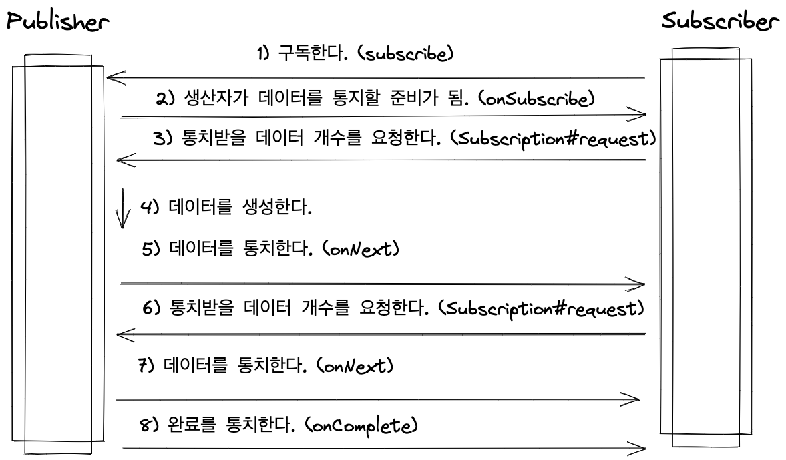

# Tech Seminar: Reactor

## 핵심 용어정리

- Reactive Programming
    - 데이터가 통치될 때마다 ‘반응’ 해서 데이터를 처리해나가는 것.
    - ex) GPS 위치 정보를 계속해서 보내고, 그거에 맞게 지도에 나타내는 것.
- Reactive Stream
    - 비동기로 처리할 수 있는 공통 매커니즘을 추상화 해주는 것.
    - 데이터를 생산하는 측의 `Publisher` 와 데이터를 소비하는 측의 ``Subscriber`` 를 제공해준다.
- RxJava & Reactor
    - Reactive Stream 을 구현한 것. 함수형 프로그래밍의 영향을 많이 받았다.
- Operator
    - 생성자 (Publisher) 가 통치한 데이터가 소비자에게 도착하기 전에 불필요한 데이터를 제거하거나 변환하는 과정을 제공해주는 함수.
- Backpressure
    - 한글 말로는 ‘배압'. 요청을 처리하는 측 (= Subscriber) 가 처리할 요청을 ‘제어' 하는 걸 말한다.
- Schedulers
    - 개발자가 직접 스레드를 관리하지 않아도 되도록 스케쥴러를 제공해준다. 연산을 실행하는 스레드 풀이라고 생각하면 됨.


## Publisher 와 Subscriber 의 시퀀스 다이어그램



## **Introducing Reactor**

> Reactor is a fully non-blocking reactive programming foundation for the JVM, with efficient demand management (in the form of managing “backpressure”). It integrates directly with the Java 8 functional APIs, notably **`CompletableFuture`**, **`Stream`**, and **`Duration`**. It offers composable asynchronous sequence APIs — **`Flux`** (for [N] elements) and **`Mono`** (for [0|1] elements) — and extensively implements the [Reactive Streams](https://www.reactive-streams.org/) specification.

Reactor also supports non-blocking inter-process communication with the **`reactor-netty`**
project. Suited for Microservices Architecture, Reactor Netty offers backpressure-ready network engines for HTTP (including Websockets), TCP, and UDP. Reactive encoding and decoding are fully supported.
>
- Reactor 는 jvm 위에서 non-blocking reactive programming 을 가능하게 해준다.

## 동기식 방식 vs 비동기 논블러킹 방식

- 대표적인 동기식 방식은 Spring MVC 가 있고 비동기 논블러킹 방식 (= 리액티브 방식) 은 Spring Webflux 가 있다.
- MVC 방식은 thread-per-request 방식이다.
    - 톰캣 기준으로 Thread Pool 에 생성되는 스레드 개수는 200 개 정도.
    - 블라킹 호출에서 장애를 만나게 되면 문제가 생길 수 있다. (i.e 외부 시스템 호출 장애.)
- 리액티브 방식은 Event Loop 를 이용한 모델이다.


## Event Loop 모델


- Webflux 는 Netty 의 Event Loop 모델을 차용했다.
- Event Queue 에 쌓인 Event 들을 Event Loop 에 있는 싱글 스레드가 하나씩 처리해나간다.
    - Event Loop 에 있는 스레드가 댜중일수도 있다. (기본은 싱글 스레드.) 다중이면 하나의 이벤트 큐에 접근하는 스레드가 여러개가 됨.
        - 다중 스레드가 이벤트 큐에 붙으면 이벤트 발행 순서와 처리 순서가 안맞을 수 있음.
        - 공유 자원에 접근하는 경우 스레드 경합에 CPU 를 계속해서 사용하는 형태가 됨.
        - 크게 read-modify-write, check-and-act 와 같은 문제가 생길 수 있음.
    - 이 개념에 더해서 이벤트 루프에서 처리한 이벤트 결과를 돌려주는 방식에 따라 콜백 패턴과 퓨처 (Future) 패턴으로 나뉜다. (Webflux 는 콜백패턴)
    - 네티는 이 두가지 패턴을 모두 지원한다.
- 네티의 이벤트 루프 모델의 특징은 다음과 같다.
    - 네티의 이벤트는 채널에서 발생한다.
    - 이벤트 루프 객체는 이벤트 큐를 가지고 있다. (이벤트 루프 객체가 이벤트를 처리한다.)
    - 채널은 하나의 이벤트 루프와 연결된다.

## Reactor Core

- `Flux` 와 `Mono` 만을 알면 되긴한다. 리액티브 프로그래밍에선 ``Subscriber`` 가 있어야 동작을 하지만 웹플럭스 쓸 땐 ``ServletHttpHandlerAdapter`` 에서 Handler 를 `subscribe()`  해준다.
    - ``Flux``: 0-N 개의 요소를 방출함.
    - ``Mono``: 0-1 개의 요소를 방출한다.
- 그 다음에는 어떠한 ``operator`` 가 있는지 알면 된다.
    - Creating a New Sequence.
    - Transforming an Existing Sequence.
    - Filtering a Sequence.
    - Peeking into a Sequence.
    - Handling Errors
    - Working with Time
    - Splitting a Flux
    - Going Back to the Synchronous World
    - Multicasting a Flux

### Creating a New Sequence

- item 을 내보내는 것. 대표적으로는 ``just``
- 이외에도 Iterator 로 부터 내보내는 ``Flux#fromIterable()`` 같은게 있다.
- `using` 을 이용하면 try-with-resource 와 같이 리소스를 알아서 해제해준다.

### Transforming an Existing Sequence.

- publish 하는 데이터를 변형시키는 것이다.
- 1) transform existing data
    - 가장 대표적인건 ``map`` 과 ``flatMap``  이 있다.
        - `map` 은 1 to 1 간의 데이터 변환이라면 `flatMap` 은 1 to (1-N) 간의 변화.
        - 중요한건 ``map`` 은 Sync 한 호출이고 ``flatMap`` 은 Async 한 호출이다.
- 2) add pre-set elements to an existing sequence.
    - 대표적인 메소드는 ``Flux#startWith()`` 와 ``Flux#concatWithValues()`` 가 있다.
- 3) aggregate a Flux
    - 대표적인 메소드로는 ``Flux#collectList()`` 와 ``Flux#count()``, ``Flux#reduce()`` ``Flux#all()`` 등이 있다.
- 4) combine publishers
    - 대표적인 메소드로는 ``Flux#concat()`` 과 ``Flux#merge()`` 그리고 ``Flux#zip()` 이 있다.
- 이외도 있는데 딱히 중요도가 떨어져서 여기까지.

### Peeking into a Sequence

- peeking 이라는 말은 ‘짧게, 빨리 보는법' 을 이야기한다. 여기서는 주로 디버깅 용도로 사용하는 듯?
- 대표적인 메소드로는 ``doOnNext()`` 와 ``log()`` 가 있다.

### **Filtering a Sequence**

- 요소를 필터링 하는 것. 대표적인 메소드로는 ``Flux#filter()`` 가 있다.

### Handling Errors

- 에러를 대처하는 방법을 나타내는 것.
    - Static Fallback Value
        - 기본 값을 리턴해주고 싶다면 ``onErrorReturn`` 을 통해서 처리가능.
    - Fallback Method
        - 대안적인 방법이 있다면``onErrorResume`` 을 통해서 처리 가능.
    - Dynamic Fallback Value
        - fallback value 를 리턴해주고 싶다면 ``onErrorResume`` 을 통해서 처리 가능하다.
    - Catch And Rethrow
        - `rethrow` 를 통해서 예외를 다시 던지는 것도 가능하다.
    - Log or React on the Side
        - 에러가 났을 때 로그를 남기고 싶다면 ``doOnError`` 에서 남기는게 가능하다.
    - Using Resources and the Finally Block
        - ``doFinally`` 를 통해서 리소스 사용을 닫을 수 있다.
        - 아니면 ``using()`` 을 통해서도 가능.
    - 이외에도 ``retry`` 를 통해 다시 시작하는 방법도 있음.

### Working with Time

- 요소를 방출하는 시간을 조절하고 시간 객체를 같이 반환하는 방법을 말한다.
- 대표적인 메소드로는 ``Flux#interval`` 와 ``Flux#timed()`` 가 있다.

### Splitting a Flux

- Flux 를 Flux<Flux<T>> 로 변경하는 방법으로 Flux 자체를 여러개로 쪼개는 방법을 말한다.

### Going Back to the Synchronous World

- Async 한 연산을 Sync 한 연산으로 바꿔주는 것. 주로 테스트 할 때 한번씩 쓰는듯?
- 대표적인 메소드로는 ``Flux#blockFirst(), Flux#blockLast(), Mono#block()`` 등이 있다.

### Multicasting a Flux to several Subscribers

- 여러개의 subscriber 를 publisher 에게 연결하도록 해주는 메소드들을 포함.

## Testing & Debugging

- Debugging 은 주로 메소드 체이닝에 ``log()`` 를 걸어둬서 편리하게 로그를 찍어보는 방법을 많이쓴다.
- 테스트는 ``StepVerifier`` 를 이용해서 방출하는 데이터를 체크한다. (진짜 간단한거면 `block()` 을 이용한 테스트도 하는듯.

```java
@Test
public void testFruitBaskets() {
    final FruitInfo expected1 = new FruitInfo(
        Arrays.asList("kiwi", "orange", "lemon"),
        new LinkedHashMap<String, Long>() { {
            put("kiwi", 2L);
            put("orange", 2L);
            put("lemon", 2L);
        }}
    );
    final FruitInfo expected2 = new FruitInfo(
        Arrays.asList("banana", "lemon", "kiwi"),
        new LinkedHashMap<String, Long>() { {
            put("banana", 1L);
            put("lemon", 2L);
            put("kiwi", 1L);
        }}
    );
    final FruitInfo expected3 = new FruitInfo(
        Arrays.asList("strawberry", "orange", "lemon", "grape"),
        new LinkedHashMap<String, Long>() { {
            put("strawberry", 2L);
            put("orange", 1L);
            put("lemon", 1L);
            put("grape", 1L);
        }}
    );
    StepVerifier.create(getFruitsFlux())
        .expectNext(expected1)
        .expectNext(expected2)
        .expectNext(expected3)
        .verifyComplete();
}
```

## Reactive Programming 를 잘 하는 방법

### 동기식 연산을 사용하지 않는다.

- blockHound 를 이용하면 검출할 수 있다.
    - 테스트 코드에 ``BlockHound.install()` 를 붙혀서 실행할 수도 있고, SpringApplicaiton 이 시작하는 코드에 넣어서 검출해볼 수 있다. (동기식 연산이 실행되면 에러가 뜬다.)

```java
// Example.java
BlockHound.install();

Mono.delay(Duration.ofSeconds(1))
    .doOnNext(it -> {
        try {
            Thread.sleep(10);
        }
        catch (InterruptedException e) {
            throw new RuntimeException(e);
        }
    })
    .block();
```

- 동기식 연산이 필요한 경우에는 스케줄러를 바꾸는 것. (아예 다른 스레드 풀로 바꾸는 걸 말한다.)
    - 이 경우에는 ``Schedulers.boundexElastic()`` 을 사용하면 된다.
- Note) CPU 집약적인 연산을 쓰는 경우에도 기존 웹플럭스 스레드 풀을 이용하면 응답속도 지연이 있을 수 있으므로 스레드 풀을 바꾸는 걸 권장한다.

### 병렬로 작업이 필요한 경우에는 스케줄러를 바꾼다.

- Reactor 나 RxJava 같은 경우는 스케줄러를 갈아탈 수 있다. (기본적으로는 싱글 스레드.)
- ``Schedulers.parallel()`` 를 쓰면 병렬 스케줄러를 통해서 실행하는게 가능함.
- 병렬로 실행할 경우에는 Context Switching 비용을 고려하자. 굳이 병렬로 안하는게 더 빠를 수도 있다.
- 실제 사용은 ``subscribeOn(Schedulers.parallel()`` 을 이용한 작업과 ``publishOn(Schedulers.parallel()`` 를 쓰는 방법, `parallel(N).runOn(Schedulers.parallel())` 을 이용한 방법이 있다. (물론 다 Flux 에서만 사용이 가능함.)
    - ``parallel(N).runOn(Schedulers.parallel())`` 이후에 다시 순차적으로 실행하고 싶다면 `sequential()` 를 호출하면 됨.

### Hot vs Cold Stream

- Publisher 는 Hot 과 Cold 의 개념으로 나뉜다.
    - 하나보다 더 많은 Subscriber 가 붙을 수 있으면 Hot 이라고 부르고, 하나만 붙을 수 있다면 Cold 라고 부른다.
    - 기본적으로 Flux 와 Mono 둘 다 Cold 이다.
- Hot 을 이용하는게 데이터의 중복을 줄이는 경우가 있다. 필요에 따른 여러개의 스트림을 만드는 경우보다 하나의 스트림을 구독하는 Subscriber 를 여러개 만드는게 낫다. 그게 데이터 중복을 줄임.
    - ex) 여러 종류의 과일을 내보내는 Publisher 가 있고, 우리는 각 과일의 개수를 세는 작업과 과일의 종류를 세는 작업을 하려고 할 때, 각각의 Publisher 로 변환하는 것보다 Subscriber 를 두 개 만드는게 낫다.
    - Hot 을 이용하는게 그리고 처리가 지연되지 않는다.

### 적절한 Batch 작업을 이용한다.

- Reactor 에서는 세 종류의 Batch 작업을 제공한다. (grouping, windowing, buffering)
    - Grouping: ``Flux<GroupedFlux<T>>`` 주어진 key 를 바탕으로 grouping 을 하는 걸 말한다.
        - 계속해서 새로운 키를 내는 작업이라면 적절하지 않다.
        - 그룹수가 중간보다 적은 경우가 적절하다.
        - 카디널리티가 높으면 (= 중복이 적으면) 동시성이 낮을 수 있기 떄문에.
    - Windowing: ``Flux<Flux<T>>``, size, time, boundary-defining predicates 로 쪼개는 걸 말한다.
    - Buffering: ``Flux<List<T>>`` window 와 비슷하다. 반환하는 타입이 좀 다름.

### 클린 코드를 위한 소소한 팁

- 코드의 가독성을 위해 람다식보다 `Method Referecne` 를 이용하려고 하자.
- `transform()` 을 이용해 재사용성을 늘리고 깔끔한 코드를 만들 수 있다.
